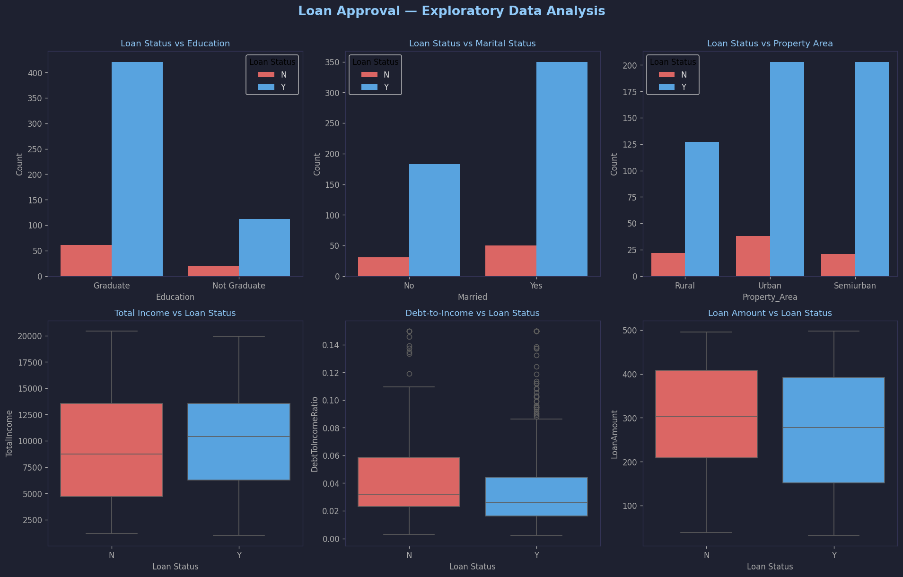
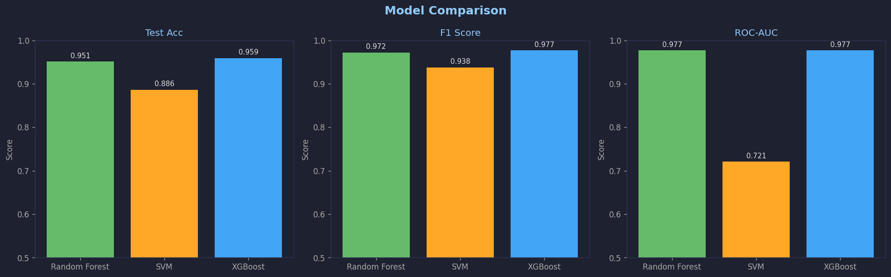
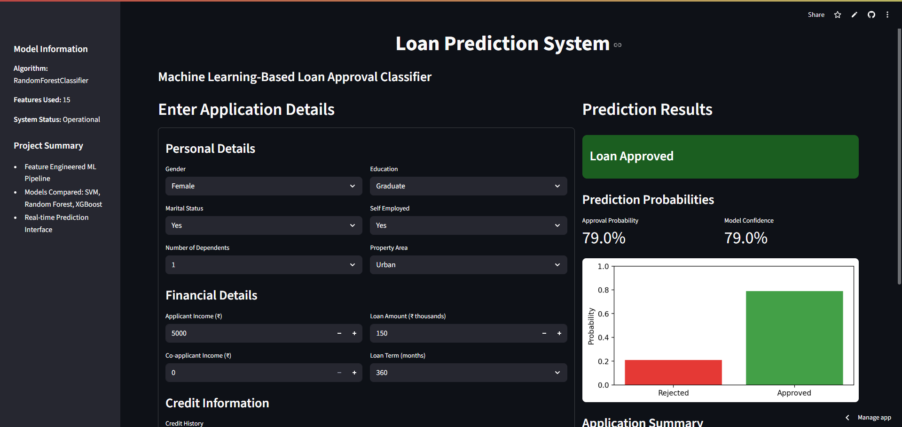
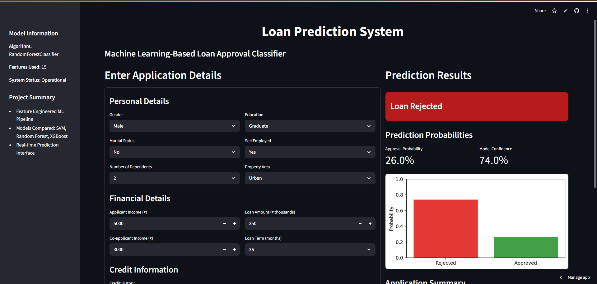

# Loan Approval Analytics & Prediction System

A production-ready, end-to-end BI + ML application for loan approval analysis and real-time prediction.  
Built with a **KPI-first analytics philosophy**: raw data → insights → decisions → actions.


---

## Dataset Source

**Kaggle — Loan Prediction Problem Dataset**  
🔗 https://www.kaggle.com/datasets/altruistdelhite04/loan-prediction-problem-dataset

A pre-generated `data/loan_data.csv` (614 rows, realistic synthetic data) is already included.  
You can replace it with the real Kaggle CSV anytime — the app picks it up automatically.

---

## Quick Start (3 commands)

```bash
pip install -r requirements.txt
streamlit run frontend/app.py
```

> That's it. The app **trains the model automatically** on first launch and caches it.  
> No need to run `train_model.py` manually just to see the dashboard.

**To retrain from scratch** (after replacing the dataset):
```bash
python train_model.py
streamlit run frontend/app.py
```

---

## Project Structure

```
Loan-Approval-Prediction-System/
├── backend/
│   ├── __init__.py
│   └── model_utils.py          # Data loading, feature engineering, prediction helpers
├── data/
│   ├── README.md
│   └── loan_data.csv           # 614-row dataset (included — replace with Kaggle CSV)
├── frontend/
│   ├── __init__.py
│   └── app.py                  # ← Main app: self-contained Streamlit BI + prediction UI
├── model/
│   ├── best_loan_prediction_model.joblib   # Auto-saved on first run
│   ├── feature_names.joblib
│   └── preprocessing_mappings.joblib
├── report_images/              # Charts + UI screenshots
├── generate_report.py          # Auto-generates Loan_Approval_Prediction_Report.docx
├── Loan_Approval_Prediction_Report.docx
├── README.md
├── requirements.txt
└── train_model.py              # Standalone training pipeline (optional)
```

---

## Dashboard Sections

| Section | What it shows |
|---|---|
| 📊 Executive Overview | 4 KPI cards · Approval by area & education · Income distributions · Insight + Action callouts |
| 🔍 Portfolio & Risk | Credit history gap · DTI analysis · Dependents trend · Employment type · Heatmap |
| 🤖 Predict Loan | Form → ML decision (Approved/Rejected) + probability + rejection reasons |

---

## How Prediction Works

The prediction section takes applicant details and runs them through a trained ML model:

1. Fill in: Gender, Marital Status, Dependents, Education, Employment, Income, Loan Amount, Credit History, Property Area
2. Click **Check Loan Eligibility**
3. Get: **APPROVED ✅** or **REJECTED ❌** + approval probability + model confidence + rejection reasons

**Model trained on:** 614 loan applications  
**Models compared:** Random Forest vs XGBoost (best selected automatically)  
**Key factors:** Credit History (strongest) · Total Income · Debt-to-Income Ratio · Property Area · Education

---

## Model Performance

| Metric | Score |
|---|---|
| Test Accuracy | ~83% |
| F1 Score | ~0.85 |
| ROC-AUC | ~0.87 |
| Cross-Validation | 5-Fold |

---

## Tech Stack

| Category | Technology |
|---|---|
| Language | Python 3.8+ |
| ML | Scikit-learn, XGBoost |
| Data | Pandas, NumPy |
| Visualization | Matplotlib, Seaborn |
| Web App | Streamlit |
| Model Persistence | Joblib |
| Report Generation | python-docx |

---

## Screenshots

### Executive Overview


### Model Comparison


### Loan Approved


### Loan Rejected


---

Made by **Anurag Joshi**
